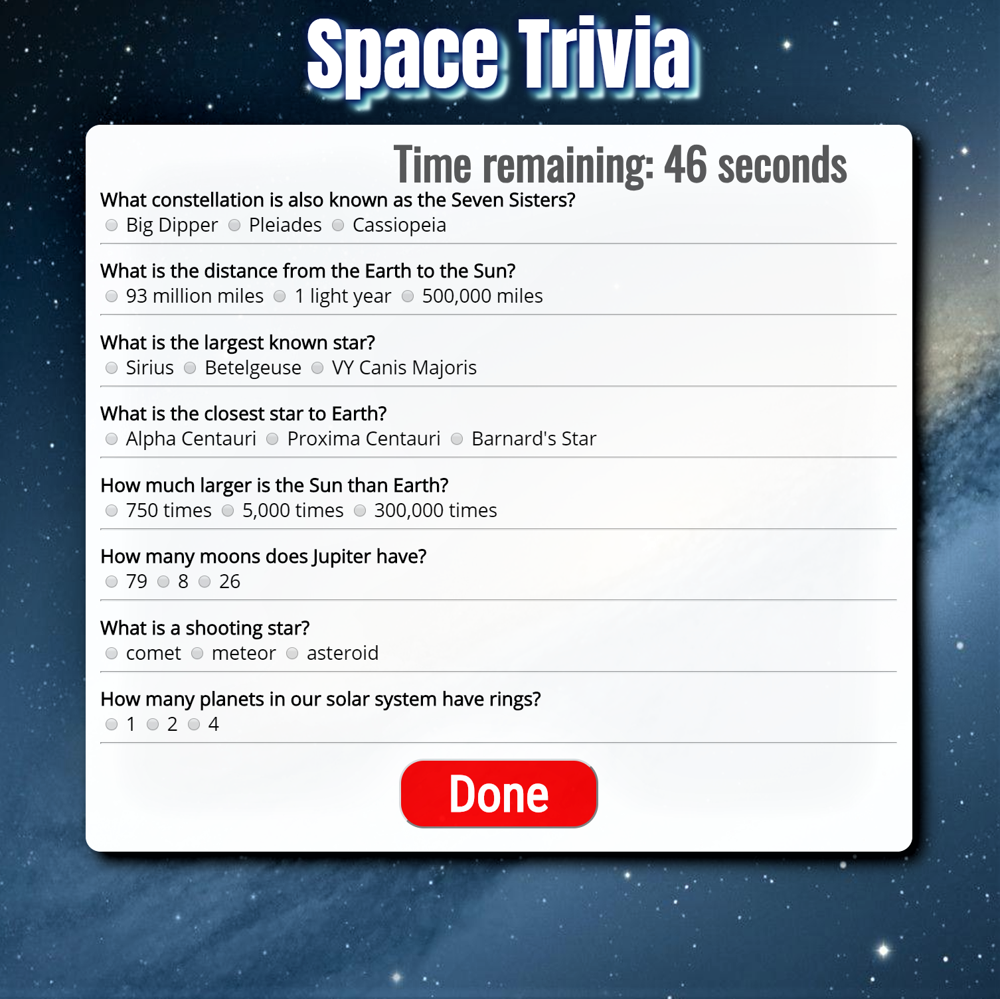
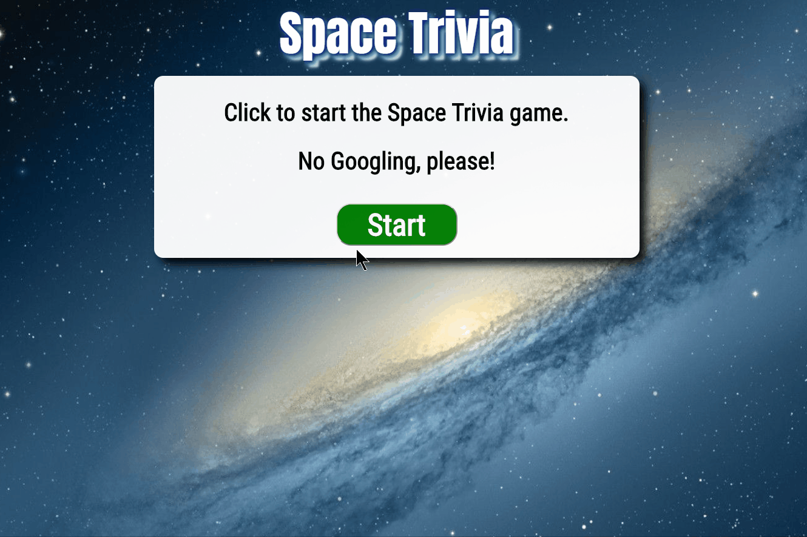

# TriviaGame

## About Space Trivia

The goal of **Space Trivia** is to correctly answer all of the questions by selecting the correct radio button. Wrong answers are scored separately from questions that are not answered. A start button begins the game, and the game ends either when the timer runs out or the user clicks the done button.

## Description of the problem:

Space Trivia needed to display questions and radio buttons for possible answers on screen. Questions and answers are in an array of objects. Each object contains the question, an array of possible answers, and the correct answer.

There also needed to be a way to check user answers against an array of objects, with each question an individual object. The questions needed to be scored correctly, and a timer would start counting down once the user clicked `start`. Correct answers, incorrect answers, and unanswered questions were to be scored separately.

## Technical Solutions:

- The questions and answers are hard-coded into the HTML; a future version will have the questions and answers generated via jQuery.
- A for loop iterates through the questions array and checks the user answer against the correct answer.
- JavaScript conditionals increment the appropriate score counter based on whether the question was answered correctly, incorrectly, or not at all.
- The timer was managed by a function that runs the setInterval() method. Once the timer

## Demo:

## Built with:

- JavaScript
- jQuery
- HTML 5
- CSS 3

## Authors:

**Space Trivia** was coded by me, and is maintained by me.

## Future development:

- Dynamically generate questions/radio buttons/assign answers to radio buttons via jQuery.
- Make app more mobile-friendly with larger radio buttons
- update JavaScript with ES6 syntax
- add button for user to return to start screen
